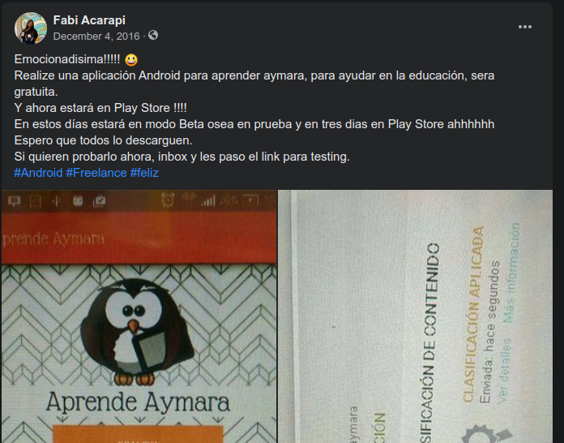
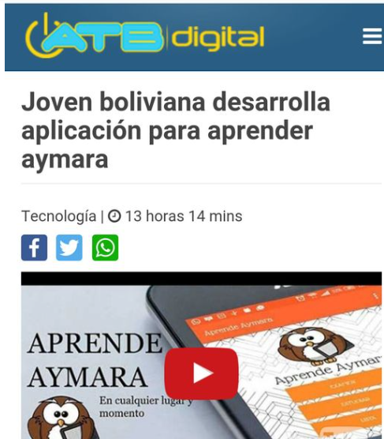
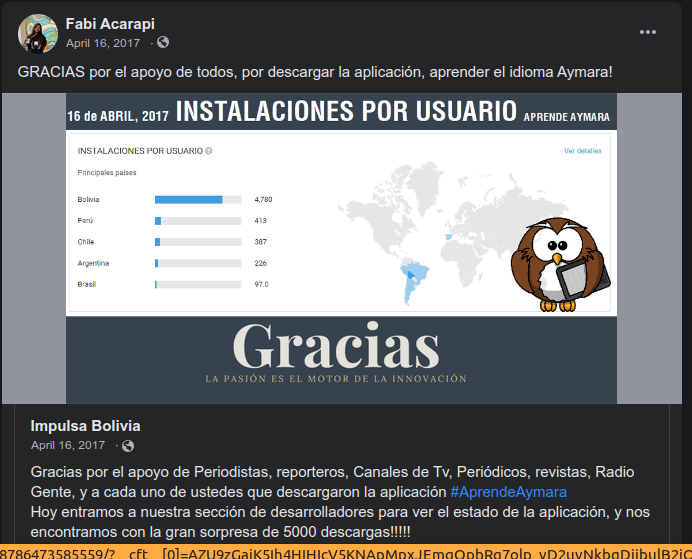
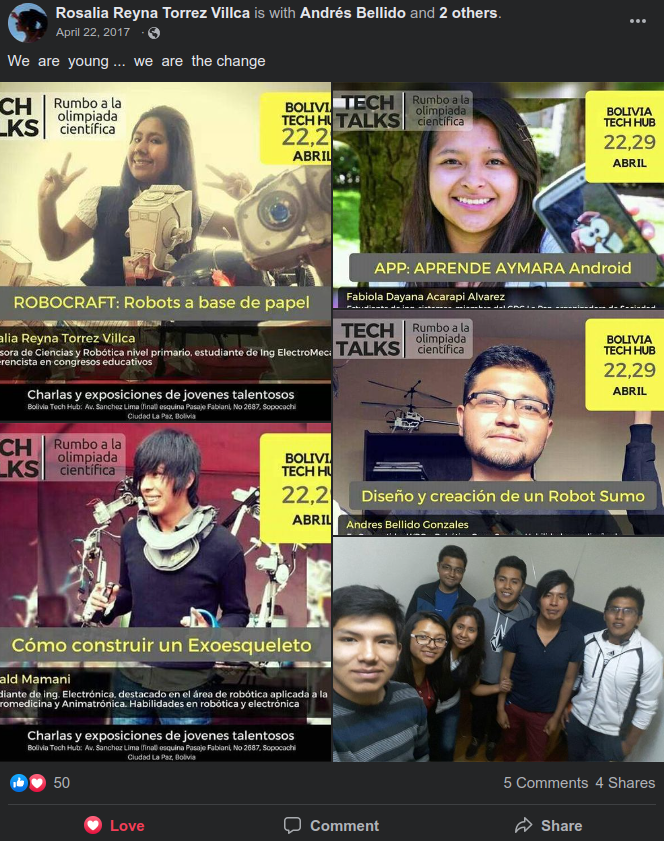
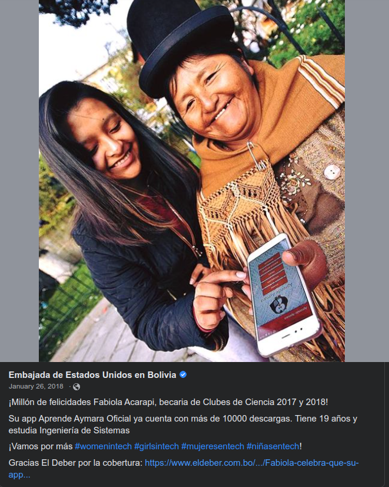
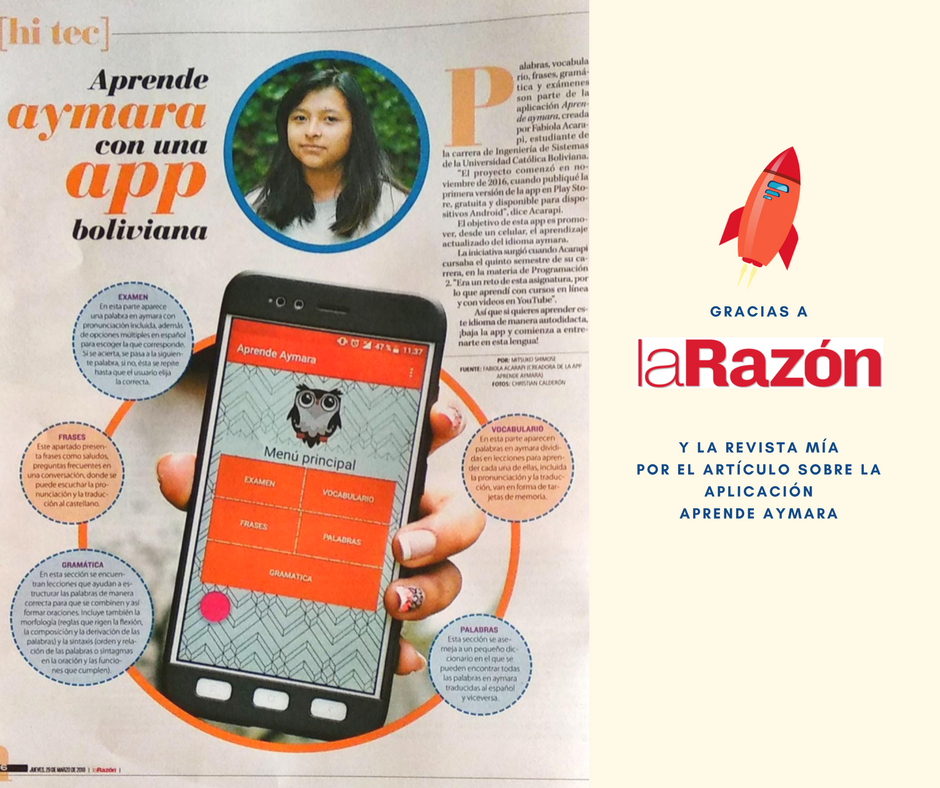
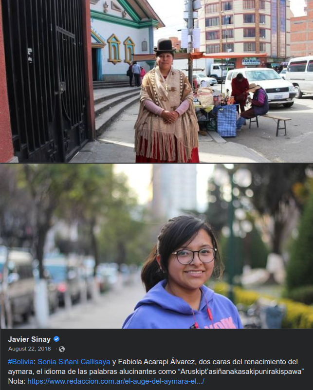

# Aprende Aymara - App

Aprende Aymara es una aplicación móvil donde puedes aprender el idioma Aymara, lo desarrollé a los 18 años en 2017. En este blog recopilo los logros que tuvo el proyecto de forma cronológica.

## Inicio de la aplicación - 4 de diciembre de 2016

Esta fue mi publicación en Facebook celebrando que publiqué mi primera aplicación en PlayStore, era un hito para mi ya que en ese momento estaba terminando mi segundo año en la universidad. En la materia de programación aprendí a crear aplicaciones móbiles en Android, debo destacar que todo lo aprendi con videos de Youtube, con todo lo que aprendí quería crear una aplicación que puedan usar mis amigos entonces busque ideas, la App que más usaba era Duolingo entonces surgió la idea de hacer un Duolingo para Aymara. Después de unos meses ya terminaba la App, mi abuelo me ayudo con las grabaciones del audio, el es nativo parlante del Aymara entonces el fue la voz.

## Febrero de 2017

Después de dos meses de la publicación en PlayStore tenía 30 descargas, la mayoria de mis amigos y familia, me propuse difundirlo y comencé a enviar mensajes a los noticieros pero nadie mostraba interés hasta que PICA, un noticiero para jóvenes hizo una nota sobre la App, al publicarlo los noticieros más grandes les llamó la atención. **"Joven boliviana desarrolla aplicación para aprender aymara"**, el titular de mi primera entrevista en una televisora nacional, el 16 de febrero de 2017.

## Abril de 2017

### Radio Gente 88.9 FM
Participé en el programa Gente de Rojo, Amarillo y Verde, un programa que llegaba a las provicias del país, fue la oportunidad donde pude compartir la visión de la App e invitación que descarguen la App.

### 5mil descargas
La promoción de la App en la prensa habia funcionado, 5mil descargas en un mes.

### Más jóvenes en innovación
Erick era un emprendedor en el área de robótica, el me invitó a dar una charla en su evento "Rumbo a las olimpiadas científicas", iba a ser la primera vez que yo sería ponente. Conocí a otros jóvenes talentosos que estaban en el mismo rumbo que yo, innovar.

## Mayo de 2017
**"La chica tras la app para aprender Aymara"** asi se tituló mi primera entrevista en vivo, los periodista visitaron mi casa para conocerme y conocer el porqué cree la App. Video recopilado en Youtube: [video](https://youtu.be/hsso-Xn98mU).  [Nota completa](#)

<iframe width="560" height="315" src="https://www.youtube.com/embed/hsso-Xn98mU" title="YouTube video player" frameborder="0" allow="accelerometer; autoplay; clipboard-write; encrypted-media; gyroscope; picture-in-picture" allowfullscreen></iframe>

## 2018
### Un post desde la Embajada de Estados Unidos en Bolivia
Participé en el programa de Clubes de Ciencia, talleres de ciencia, patrocinado por la Embajada de Estados Unidos, en base a eso tuve la oportunidad de conocer al comite de becarios y su apoyo en la difusión del proyecto.

### 14mil descargas

**Aprende Aymara con una App Boliviana** Publicado el día jueves 29 de marzo de 2018, en ese momento la app llevaba 14mil descargas.

Nota:
Mientras estoy escribiendo este blog, cuatro años después de los eventos, me doy cuenta que muchas notas de prensa digitales no están disponibles, ya no hay registro entonces si no funciona algún URL por favor puedes pasar a la sección de Media Interview ahí estoy copiando.

### Entrevista para Redacción - Argentina

Mi primera entrevista internacional fue con Redacción, donde participe con Sonia Siñani Callisaya, el periodista nos llamo como "dos caras del renacimiento del aymara".
Javier Sinay, escritor de **Redacción** prensa de Argentina, realiza una nota sobre cómo los bolivianos están rescatando los idiomas nativos.
> Autor: Javier Sinay - Fecha de publicación: 22 Ago 2018

Fuente original: [Redacción - Periodismo Humano](https://www.redaccion.com.ar/el-auge-del-aymara-el-idioma-de-las-palabras-alucinantes/?fbclid=IwAR0WSaXfllJvcINscVmibVlcyIi5v67p45zKRJ9EKYswdL71RH3XdtlH59o) Artículo en PDF: [PDF](https://drive.google.com/file/d/104NAr0WKh91GNEWbMxIrwBBbcCQ3SX0A/view?usp=sharing)