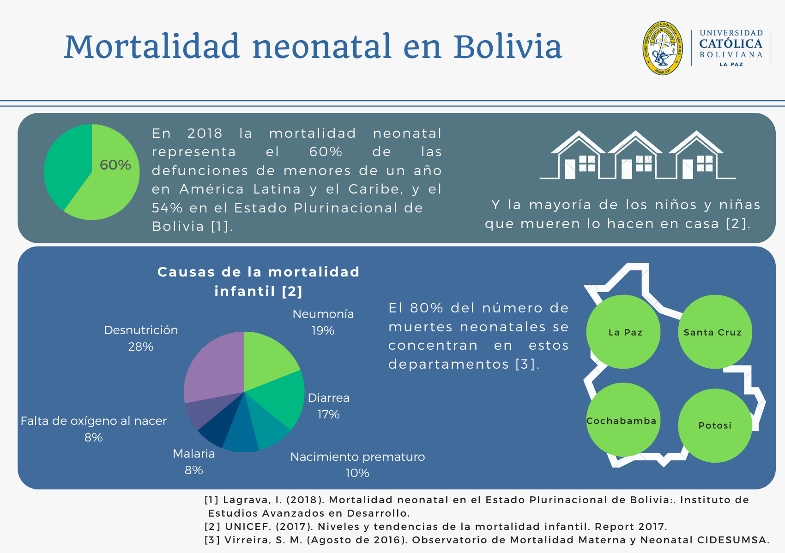
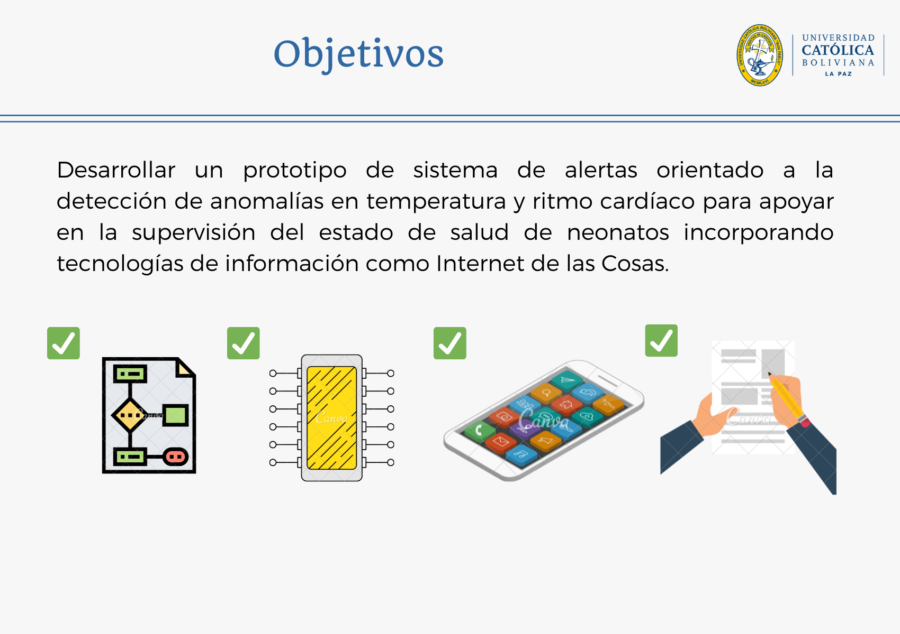
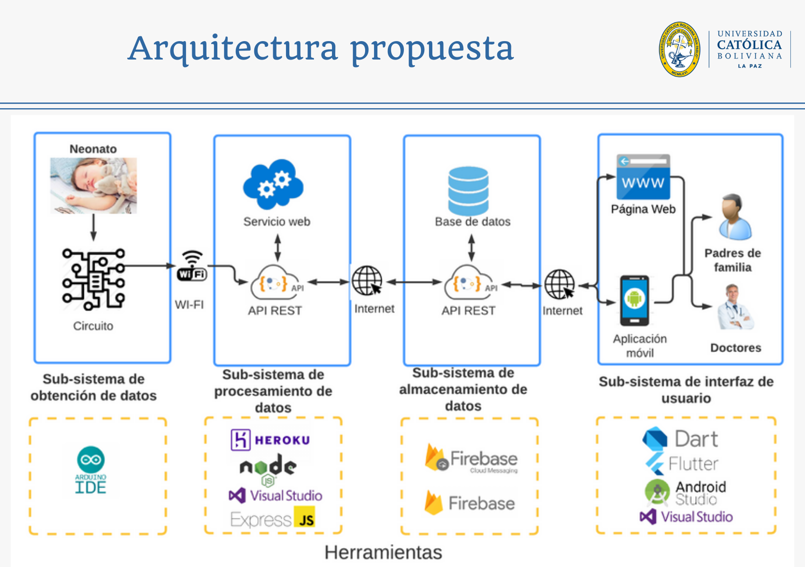
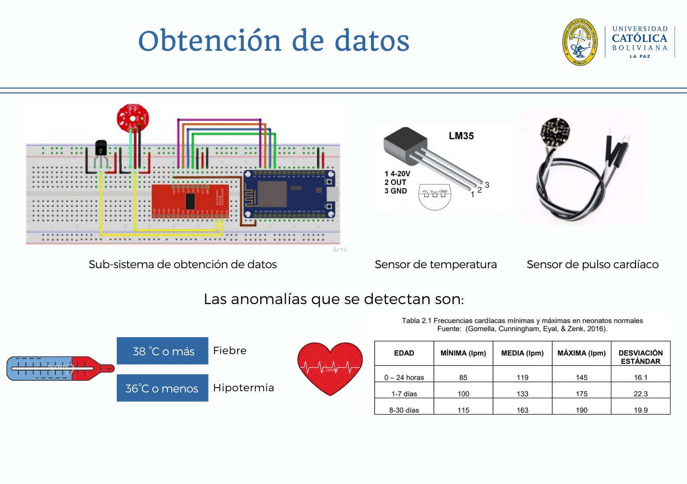
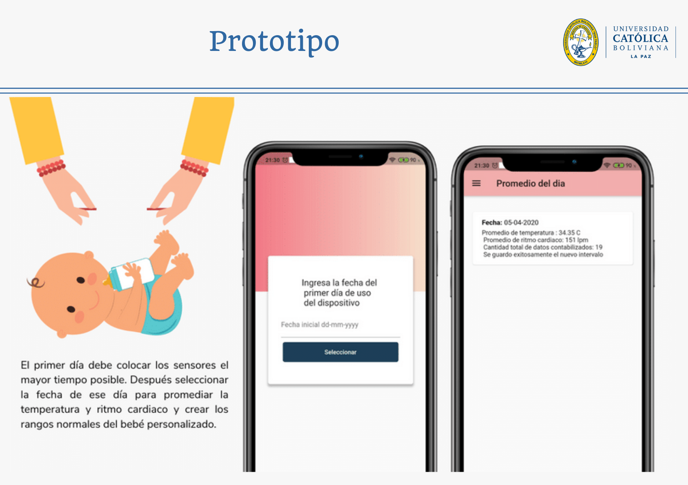
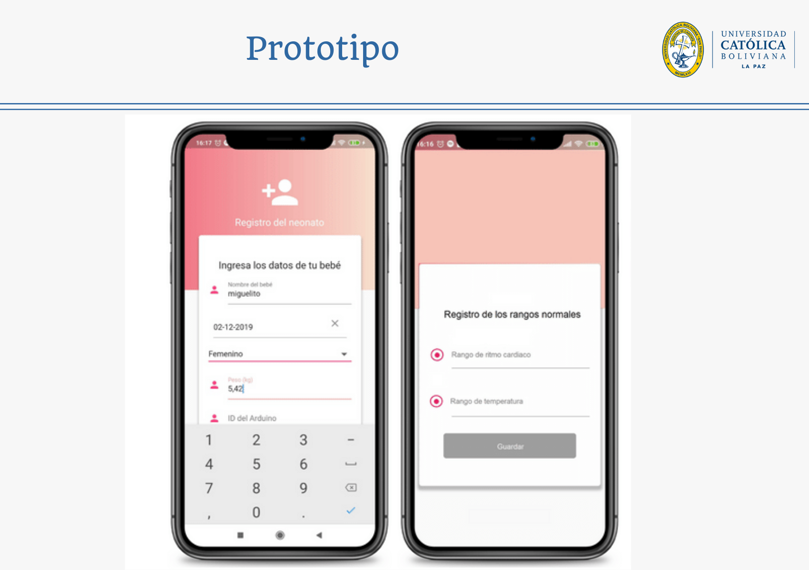
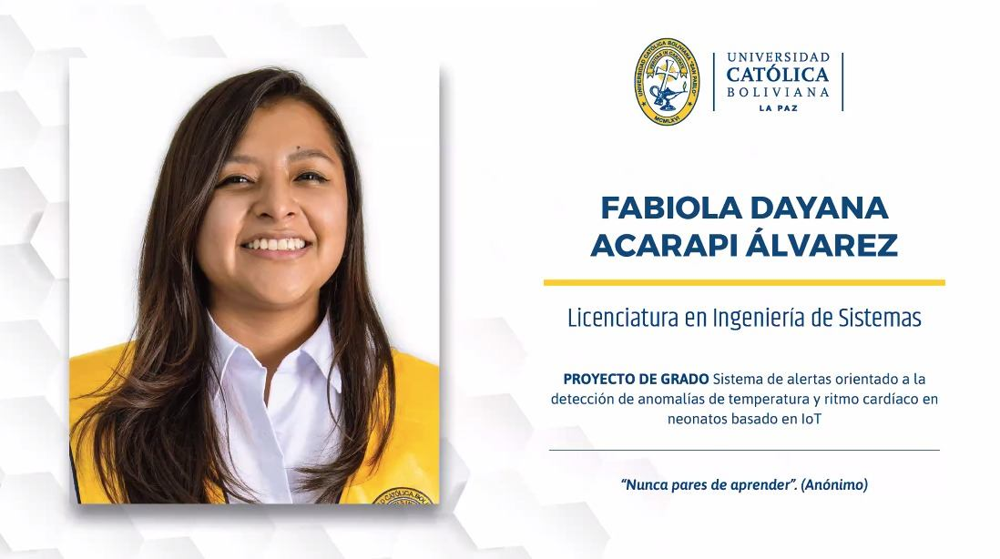

# IoT enfocado en Neonatos - Proyecto de Grado

**Nombre del proyecto de grado:** Sistema de alertas orientado a la detección de anomalías de temperatura y ritmo cardíaco en neonatos basado en IoT.

Este trabajo propone la aplicación de Internet de las cosas, para detectar anomalías de temperatura y de ritmo cardiaco en neonatos. Se utilizó sistemas interconectados a través de Internet como microcontrolador, sensores, aplicación móvil, página web, servicio de base de datos en la nube y servicio web. El sistema permite alertar sobre cambios fuera de lo común de los signos vitales a tiempo real, independientemente de la ubicación de los padres de familia y doctores, dando oportunidad a la supervisión de forma remota.

## Problemática

Los bebés en período neonatal componen el 40% de los casos de niños menores de cinco años que fallecen cada año. La mayoría de las muertes se producen en los hogares que no tienen acceso a una adecuada atención de salud (Mera, 2020). “La mortalidad de la niñez (menores de cinco años), es uno de los indicadores que refleja con mayor claridad la situación de un país, ya que los factores que la determinan son diversos y muchas veces estructurales”, señaló el Ministerio de Salud y el Instituto Nacional de Estadística, en los resultados de la Encuesta de Demografía y Salud en 2016 (Institulo Nacional de Estadística, 2017).

La tasa de mortalidad infantil de los países de Sudamérica en 2018.Se puede observar que Bolivia tiene la mayor tasa de mortalidad infantil entre los países vecinos, por cada 1000 nacidos vivos, mueren 34. En cambio, en los países líderes con menor tasa en la región se tiene a Chile con 6 muertos de 1000, Argentina con 10 muertos de 1000 y Uruguay 8 muertos de 1000 (CIA World Factbook, 2019).

Según UNICEF, en los países en desarrollo, alrededor del 80% de la atención en salud se presta en el hogar, y la mayoría de los niños y niñas que mueren lo hacen en casa, sin que los examine un trabajador de la salud (UNICEF, 2018). Por esa razón, los hogares con bebés que tienen más riesgo de padecer enfermedades cardíacas como recién nacidos (RN) prematuros, con problemas al nacer o madres que tuvieron embarazo riesgoso, presentan mayor necesidad de supervisar sus signos vitales.

En Bolivia, la mortalidad materna y neonatal no ha logrado disminuir sus altos índices desde hace varias décadas y en la actualidad sigue presentando las más altas tasas de América Latina y el Caribe, después de Haití, constituyéndose en un serio problema social y de salud pública. Según el Estudio Nacional de Mortalidad Materna en 2011, en relación con la mortalidad neonatal, se estima que en el Bolivia ocurren, aproximadamente, algo más de 8.000 muertes neonatales por año a causa de infecciones, asfixia y prematurez. La Paz, Cochabamba, Santa Cruz y Potosí, concentran algo más del 80% del número de muertes neonatales (Virreira, 2016, p. 5).

## Objetivos del proyecto

Desarrollar un prototipo de sistema de alertas orientado a la detección de anomalías en temperatura y ritmo cardíaco para apoyar en la supervisión del estado de salud de neonatos, incorporando tecnologías de información como Internet de las Cosas.
Objetivos específicos:
- Definir un esquema de parámetros según las variables de entrada y salida del sistema para estandarizar el proceso de recolección de datos.
- Desarrollar un subsistema de obtención de datos mediante sensores incorporando las tecnologías IoT para medir la temperatura y el pulso cardíaco.
- Desarrollar un subsistema de alertas dentro de una aplicación móvil para la supervisión del estado de salud del neonato desde un celular con sistema operativo Android.
- Desarrollar un subsistema de reportes sobre el ritmo cardíaco y temperatura desde la aplicación móvil para apoyar en la supervisión del estado del neonato.

## Arquitectura Propuesta
La arquitectura propuesta del sistema de alarmas se muestra en la siguiente imagen.

La arquitectura propuesta del proyecto dividida en cuatro subsistemas, agrupados en cuadros con bordes de línea continua. Las flechas representan la dirección en la que se envía la información. Los subsistemas se comunican a través de wifi e Internet, representados por íconos fuera de los cuadros. En la parte inferior se muestra las herramientas que se utiliza para el desarrollo de cada subsistema, agrupados dentro de cuadros con borde punteado. El desglose de cada subsistema es el siguiente:
- **El subsistema de obtención de datos**, descrito en la figura 3.6. Interacciona con el paciente que es el bebé en etapa neonatal.
- **El subsistema de procesamiento de datos**, se compone por la API REST y el servicio web. Utilizado para tratar los datos de los sensores con la lógica de negocios y generar notificaciones. Las herramientas utilizadas son Heroku para almacenar la plataforma en la nube y para desarrollar el entorno son Node JS, Express JS y Visual Studio.
- **El subsistema de almacenamiento de datos**, se compone por los servicios de Firebase para almacenar la base de datos, autentificación de usuarios y notificaciones.
- **El subsistema de interfaz de usuario** se compone por la aplicación móvil desarrollado en Flutter, Dart y Visual Studio. Y una página web desarrollada en HTML, CSS y Javascript.

Los cuatro sistemas se comunican con wifi para la comunicación inalámbrica y HTTP para la transferencia de información con la base de datos ubicada en un servidor en la nube.

Los componentes de hardware del subsistema de obtención de datos. Los sensores de pulso cardíaco y de temperatura se conecta al cuerpo del neonato, lo envía al NodeMCU a través del multiplexor. Finalmente, el NodeMCU envía los datos por medio del módulo wifi dentro de la placa.

El sistema permite el monitoreo del bebé de forma remota utilizando la red wifi del hogar para que el sistema de obtención de datos pueda conectarse a Internet y enviar los datos. Los datos se envían a una API del servicio web, el cual los procesa para agregar fecha y hora de la obtención de datos, almacenarlo en la base de datos y ejecutar el envío de notificaciones a la aplicación móvil si es necesario. Además, se cuenta con un sistema de almacenamiento de datos con el cual será posible la autentificación de usuarios y la generación de notificaciones. Los padres de familia y doctores pueden acceder al sistema desde cualquier lugar mediante una aplicación móvil que accede a los datos por Internet para visualizar el estado de salud del bebé y recibir alertas.

## Prototipo

## Video

<iframe width="560" height="315" src="https://www.youtube.com/embed/tbGBOOzOjSU" title="YouTube video player" frameborder="0" allow="accelerometer; autoplay; clipboard-write; encrypted-media; gyroscope; picture-in-picture" allowfullscreen></iframe>

Te comparto un video corto de la explicación del proyecto [video en Youtube.](https://youtu.be/tbGBOOzOjSU)

La presentación que realice en la Defensa Final te comparto en [formato PDF](https://drive.google.com/file/d/1pFZCr8ZLTat82qwxvvTs5DqAvoFvxBgR/view?usp=sharing).

## Disponible en Biblioteca Central – Sede La Paz
Actualmente el documento completo esta disponible en la Biblioteca Central de la Universidad Católica Boliviana, también esta disponible en forma virtual, ingresa al siguiente link https://www.bibvirtual.ucb.edu.bo/opac/Record/101005874

## Fue mi proyecto final para la universidad

El proyecto de grado lo realicé en pandemia, fue un reto ya que no solo las defensas eran online sino que el proyecto necesitaba componentes electrónicos entonces en medio de la cuarentena estricta fue dificil conseguirlos. Soy consciente de que soy "first-generation student", son aquellos que son los primeros en sus familias en asistir a la universidad, que orgullo y privilegio poder conseguirlo.
