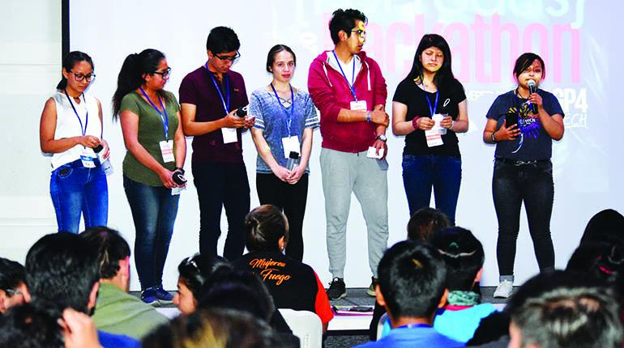
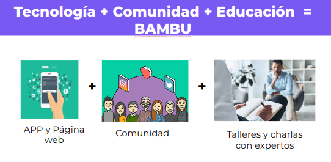

# Bambu Bolivia - Startup

> Tecnología disruptiva a favor de la prevención de la violencia de género. Emprendimiento social

## Historia
Viajamos de La Paz a Cochabamba para participar en la Hackathon de Jalasoft. Fue una maratón de 48hrs continuas para crear una solución desde cero.
Ganamos primer lugar con la idea y el producto minimo viable. Puedes leer más del evento en la [nota de prensa de Los Tiempos](https://www.lostiempos.com/tendencias/tecnologia/20200309/gp4tech-desarrollan-apps-prevenir-violencia-contra-mujer)

## Problemática
Bolivia es considerado el segundo país de América Latina con más altos índices de violencia sexual. 7 de cada 10 mujeres en algún momento de su vida han sido víctimas de abuso sexual.

## Nuestro servicio

BAMBÚ es un servicio de seguridad para mujeres con una aplicación móvil para ayudar a prevenir y reducir el   acoso y la violencia que sufren. Recuperando la confianza y seguridad entre mujeres, impulsando la sororidad.
BAMBÚ fomenta a generar una comunidad, promoviendo la solidaridad en un contexto de violencia y acoso sexual.

## Equipo
Somos un grupo de jóvenes universitarios del ingeniería mecatrónica, de ingeniería de sistemas, administración de empresa  y psicología  de UCB La Paz.
Ganamos el primer lugar de la Hackathon sobre prevención de la violencia contra la mujer en JalaSoft y vamos a materializar nuestra idea para ayudar.

##  Webinar con la Sociedad Científica de Estudiantes de Derecho
En el Webinar compartimos más sobre la visión y retos que tiene BAMBÚ. [Link del evento en Facebook](https://www.facebook.com/101758304937780/videos/629045301330123/).

## Redes Sociales
Facebook: [www.facebook.com/bambuBoliviaTech/](https://www.facebook.com/bambuBoliviaTech/)

## Estado del proyecto
Actualmente el proyecto esta suspendido.