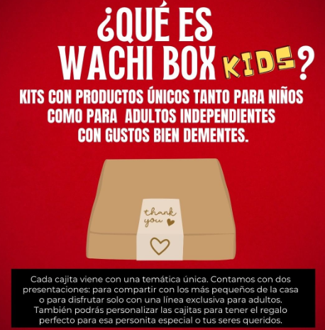

# WachiBox - A business

WachiBox es un emprendimiento que promueve el consumo de productos artesanales y nacionales mediante un nuevo canal de consumo. Se trata de cajas mensuales que ofrece a los usuarios contenidos de interés incluyendo un extra de novedad y sorpresa, ya que el cliente no sabe qué va a recibir exactamente. Entregamos mensualmente cajas sorpresas con cuatro a seis productos especiales para diferente público como niños/as y adultos.

El equipo esta conformado por tres mujeres con diferentes perfiles como programadora, mecatrónica y comercial.

## WachiBox Kids
El emprendimiento inicio en octubre de 2021 cuando los estudiantes seguian en clases online entonces sacamos WachiBoxKids donde ofrecimos actividades recreativas, manualidades donde podían aprender y jugar junto con la familia.

## Estado del proyecto
Actualmente el proyecto esta suspendido.