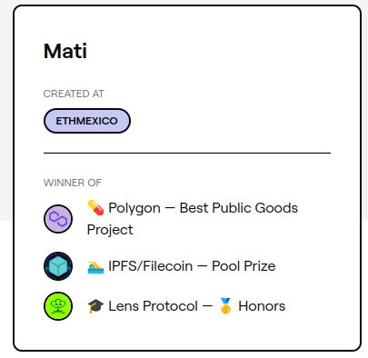

# Mati - ETHMexico

Participé en ETHMexico con el proyecto MATI, aqui comparto una recopilación del proyecto.
## ¿Qué es MATI?
En inglés:
> Create a collection of NFTs that stores the words of a native language, pronunciation and, meaning, in this way the words will be stored permanently and people will have access to this information as a repository of the different languages.

En español:
> Crear una colección de NFTs que almacene las palabras de una lengua nativa, la pronunciación y, el significado, de esta manera las palabras serán almacenadas permanentemente y la gente tendrá acceso a esta información como un repositorio de las diferentes lenguas.

La descripción oficial esta en la página de [ETHGLOBAL](https://ethglobal.com/showcase/mati-twmdv) donde también menciona los premios ganados.
## ¿Qué es ETHMéxico?
ETHMexico es un evento que reúne a algunas de las mejores mentes y expertos en Ethereum y el regreso de ETHGlobal a América Latina. Permitimos a los equipos hacer algo grande en sólo 36 horas proporcionando una abundancia de recursos de hacking como mentores, patrocinadores y software. [Link del evento.](https://mexico.ethglobal.)

## Equipo MATI
El equipo esta conformado por 5 mujeres con diferentes perfiles como programadora, diseñadora, abogada, contadora y marketing. Fue nuestra primera Hackathon en web3.
## Premios logrados

Fuimos ganadoras en tres categorías diferentes y sponsors:
- Polygon - Best Public Goods Project
- IPFS/Filecoin - Pool Prize
- Lens Protocol - Honors
Al final del evento ganamos dos premios y al día siguiente revisamos la página de la Hackathon y nos encontramos que Lens Protocol nos premió. Aqui les comaport el [tweet de MATI](https://twitter.com/MatiComunidad/status/1561801291642425345?s=20&t=1wHEOtZL_iKkJlyLIQFaVw).
Celic hizo un hilo en twitter sobre el proyecto, [link](https://twitter.com/CelicTorresz/status/1561493773955334145) donde muestra imágenes del NFT.

## Visibilización del proyecto en Twitter
### Espacio Cripto
El podcast Espacio Cripto nos dio un espacio en su Twitter Space para compartir nuestra experiencia y dar a conocer el proyecto. [Link del tweet](https://twitter.com/EspacioCripto/status/1562563433471455232?s=20&t=1wHEOtZL_iKkJlyLIQFaVw).
### H.E.R. DAO LATAM
H.E.R. es una DAO de desarrollo impulsada por mujeres que incluye a mujeres que se identifican a sí mismas, mujeres trans y público no binario. La DAO que nos permitio participar en la Hackathon con Scholarships nos felicitó en sus [redes sociales](https://twitter.com/herdaolatam/status/1562198099866812418?s=20&t=1wHEOtZL_iKkJlyLIQFaVw).
### Polygon Developers
Polygon felicito a los ganadores que patrocinaron, nosotras entramos en la categoría **Best Public Goods Project**, [tweet](https://twitter.com/0xPolygonDevs/status/1561496029744304129?s=20&t=1wHEOtZL_iKkJlyLIQFaVw).

### Filecoin
Filecoin fue otro sponsor que nos felicito en [redes sociales](https://twitter.com/Filecoin/status/1565072438022529026). pero ¿donde entra Filecoin en el proyecto?
> MATI, a decentralized database that stores the words of a native language, pronunciation and meaning as a public good to preserve native languages.

En español:
> MATI, una base de datos descentralizada que almacena las palabras de una lengua nativa, pronunciación y significado como un bien público para preservar las lenguas nativas.

El proyecto continua asi que síguenos en Twitter que ahí estamos más activos, [click en  este link](https://twitter.com/MatiComunidad/status/1573026528270684160?s=20&t=1wHEOtZL_iKkJlyLIQFaVw).
