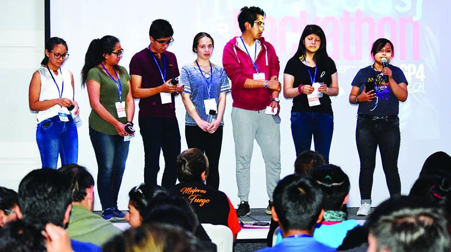

# Últimos eventos y entrevistas

Últimas publicaciones por categorías de entrevistas, eventos y proyectos.

## Media Interviews

### Desarrollan “apps” para prevenir la violencia contra la mujer

El periódico **Los Tiempos** realizó la nota sobre los ganadores de la Hackathon donde participé como mentora con el proyecto Bambu que ganó primer lugar.

<button ><a href="../docs/Media%20Interview/20200309hackathon" class="btn btn-primary">Leer más</a></button>

### El auge del aymara

Javier Sinay, escritor de **Redacción** prensa de Argentina, realiza una nota sobre cómo los bolivianos están rescatando los idiomas nativos.

<button ><a href="../docs/Media%20Interview/20180822redaccion" class="btn btn-primary">Leer más</a></button>

## Events

### Día Mundial De La Justicia Social - ONU Mujeres Bolivia

<iframe width="560" height="315" src="https://www.youtube.com/embed/pnYAWUqS4Fo" title="YouTube video player" frameborder="0" allow="accelerometer; autoplay; clipboard-write; encrypted-media; gyroscope; picture-in-picture" allowfullscreen></iframe>

> Organizado por: ONU Mujeres Bolivia.
> Fecha: 20 de Febrero de 2021.

Participé en  #DíaMundialDeLaJusticiaSocial junto con ONU Mujeres Bolivia, sobre las brechas digitales en relación con la justicia social.

<button ><a href="../docs/Events/2022021diajusticiasocial" class="btn btn-primary">Leer más</a></button>

## Projects

### Aprende Aymara - App

Aprende Aymara es una aplicación móvil donde puedes aprender el idioma Aymara, lo desarrollé a los 18 años en 2017. En este blog recopilo los logros que tuvo el proyecto de forma cronológica.

Participé en el programa de Clubes de Ciencia, talleres de ciencia, patrocinado por la Embajada de Estados Unidos, en base a eso tuve la oportunidad de conocer al comite de becarios y su apoyo en la difusión del proyecto.

<button ><a href="../docs/Projects/20190101aymara" class="btn btn-primary">Leer más</a></button>

### IoT enfocado en Neonatos - Proyecto de Grado

La arquitectura propuesta del sistema de alarmas se muestra en la siguiente imagen.

La arquitectura propuesta del proyecto dividida en cuatro subsistemas, agrupados en cuadros con bordes de línea continua. Las flechas representan la dirección en la que se envía la información. Los subsistemas se comunican a través de wifi e Internet, representados por íconos fuera de los cuadros.

<button ><a href="../docs/Projects/20210328proyectodegrado" class="btn btn-primary">Leer más</a></button>