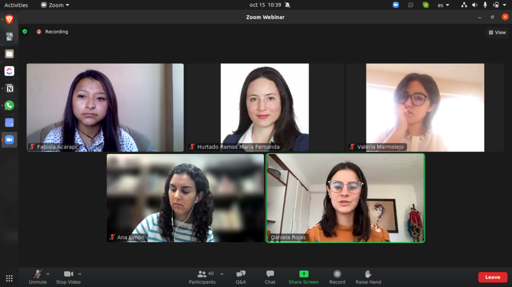

# Ponencia de Pertura en 6to Foro:CREA de la Universidad Iberoamericana

> Evento: 6to Foro: CREA.
> Organizado por: Universidad Iberoamericana de la Ciudad de México.
> Fecha: 15 de Octubre de 2021.

En la ponencia de apertura participé como ponente internacional en colaboración con Daniela Rojas Osorio, nuestra charla se llamó "Activistas, feministas y creyentes del poder de la tranformación social", nos enfocamos en negocios sociales y digitales en Bolivia y Colombia. La charla tuvo dos puntos principales: la presencia de la juventud en los negocios digitales y la necesidad de la tecnología en negocios sostenibles.

La organización del Foro fue ordenada y bien gestionada, desde la invitación a los ponentes hasta el apoyo en el evento, como se ve en la imagen superior, dos estudiantes estaban de apoyo para gestionar al público y Maria era la presentadora.

El evento abarcó a las asociaciones y colectivos estudiantiles del Sistema Universitario Jesuita, que comprende a 7 universidades en México y la universidad Rafael Landívar de Guatemala.

Link de CREA en Facebook: https://www.facebook.com/CREAIBERO/
Link del evento: https://www.facebook.com/CREAIBERO/photos/a.1140630335971866/4761331180568412/